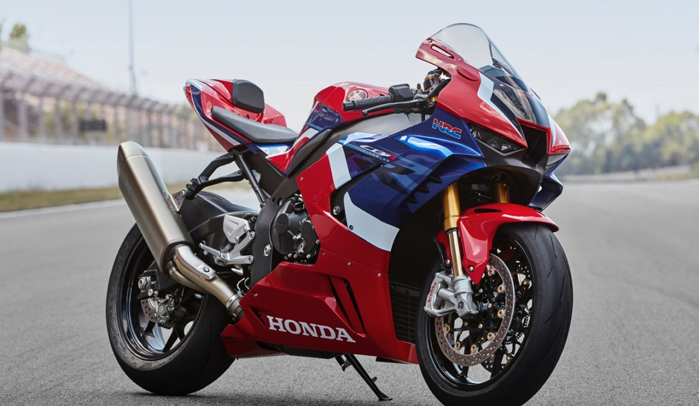

import Product from '../components/product.js'

<Product />

En este artículo encontrarás una **guía rápida** realizada por expertos para elegir la tablet que mejor se ajusta a tus necesidades, con recomendaciones de los **mejores modelos en calidad-precio** de la actualidad.

Existen tantos tamaños, sistemas operativos y modelos de tablets que a menudo resulta difícil elegir cuál comprar. Por ese motivo, **comprar una tablet** puede convertirse en una gran inversión o en una pérdida de dinero si no se elige bien.

Para facilitarte la elección puedes echar un vistazo a nuestra comparativa sobre las [mejores tablets en calidad-precio.](https://google.com)

## 1. Elige el tamaño
En primer lugar, debes elegir qué tamaño quieres para tu tablet, y eso viene determinado por el uso que pretendas darle. Las más habituales rondan las **10 pulgadas** de diagonal de pantalla, y están pensadas para un uso doméstico como ver películas, jugar, navegar por Internet y trabajar.

Las tablets pequeñas tienen pantallas de **7 u 8 pulgadas** y por su comodidad y ligereza son ideales para personas que viajan mucho o lectores de libros electrónicos.

Últimamente están apareciendo tablets de tamaño superior a las 12 pulgadas como el [iPad Pro](https://google.com) o la [Microsoft Surface Pro](https://google.com). Se trata de dispositivos diseñados exclusivamente para un uso profesional que pueden sustituir por completo un ordenador.

## 2. Elige el sistema operativo
Existen varios sistemas operativos específicos para tablets. Mientras que algunos están pensados para el entretenimiento, uso de aplicaciones y herramientas multimedia, como **Android**, otros tienen un enfoque más profesional, como **Windows**.

A continuación encontrarás nuestras **tablets recomendadas** según su tamaño y sistema operativo:

### Tablets Android
Las tablets Android son las más populares, con un gran catálogo de aplicaciones a través de [Google Play](https://google.com) y enormes posibilidades de personalización. El sistema operativo es todoterreno, capaz de adaptarse a la mayoría de necesidades

#### Recomendadas de 10 pulgadas
<-- Bloque recomendadas -->

### Tablets iOS
Los iPads de Apple funcionan bajo el sistema operativo iOS. Es un sistema fluido, sencillo y fácil de usar, aunque no permite demasiada personalización y es bastante cerrado. Además, los iPads suelen presentar un precio superior a la media.

### Tablets Windows
Son tablets diseñadas para el trabajo, por lo que suelen ser mayores de 10 pulgadas, e incluyen los programas de [Microsoft Office](https://google.com). Se trata de un sistema operativo potente pero que requiere de un mayor aprendizaje.